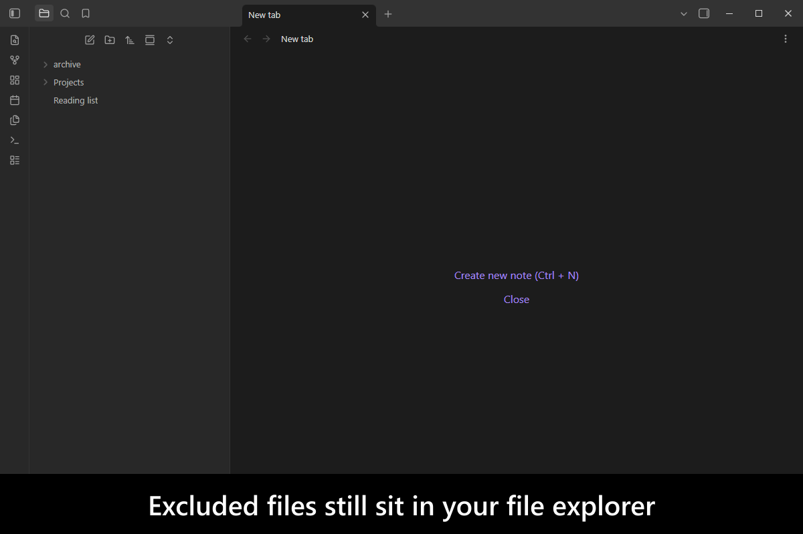
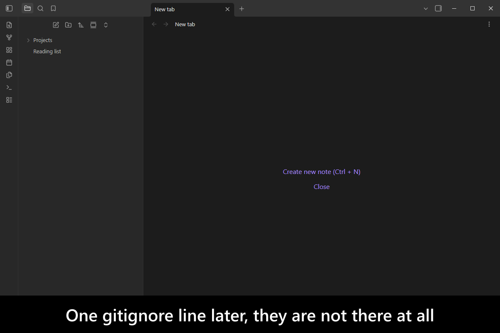
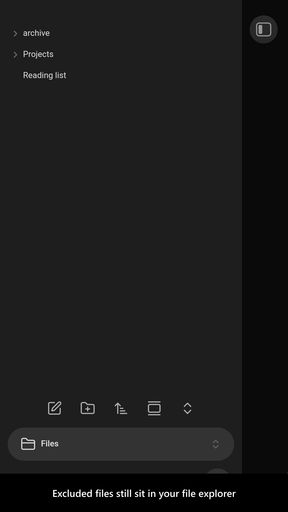
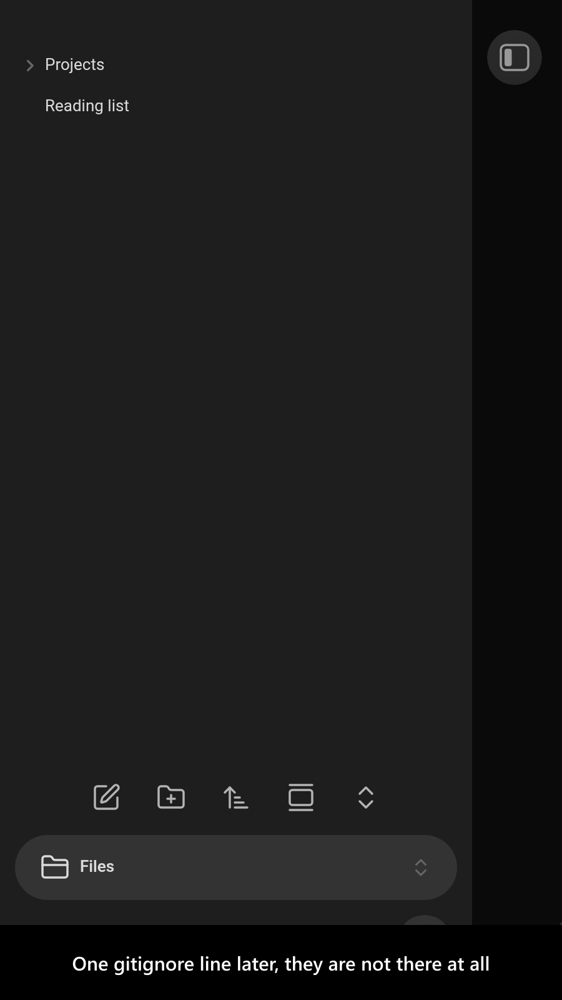

# Advanced Exclude

[](https://www.buymeacoffee.com/mnaoumov) [](https://github.com/mnaoumov/obsidian-advanced-exclude/releases) [](https://github.com/mnaoumov/obsidian-advanced-exclude/releases) [](https://github.com/mnaoumov/obsidian-advanced-exclude)

[Obsidian](https://obsidian.md/)'s `Files and links > Excluded files` setting does less than its name suggests: excluded files still sit in the Files pane, still turn up in Backlinks, still appear in search. They are de-emphasized, not excluded.

This plugin makes them behave as though they are not there, and lets you say which ones with [`gitignore`](https://git-scm.com/docs/gitignore) syntax — the pattern language you already know — from a `.obsidianignore` file, your existing `.gitignore`, or Obsidian's own setting.

> [!WARNING]
>
> The plugin makes Obsidian behave like the ignored files do not exist. This might affect features like [`Obsidian Sync`](https://help.obsidian.md/sync), [`Obsidian Publish`](https://help.obsidian.md/publish), etc.
>
> Ensure you configured the plugin correctly to avoid data loss.

<!-- markdownlint-disable MD033 -->

<a href="https://github.com/mnaoumov/obsidian-advanced-exclude/blob/HEAD/images/screenshots/screenshot-desktop-1.png"></a>

<details>
<summary>More screenshots</summary>

<div>
<a href="https://github.com/mnaoumov/obsidian-advanced-exclude/blob/HEAD/images/screenshots/screenshot-desktop-2.png"></a>
<a href="https://github.com/mnaoumov/obsidian-advanced-exclude/blob/HEAD/images/screenshots/screenshot-mobile-1.png"></a>
<a href="https://github.com/mnaoumov/obsidian-advanced-exclude/blob/HEAD/images/screenshots/screenshot-mobile-2.png"></a>
</div>

</details>

<!-- markdownlint-enable MD033 -->

## Demo vault

**The documentation is a demo vault.** Every feature has a note that explains what it does and why you would want it, with folders already in place to hide and un-hide.

**[Start reading here](<./demo-vault/00 Start.md>)** — it is plain markdown, so it works on GitHub with nothing installed.

A copy of the vault ships with every release. You can access it via any of the following:

1. Running the **Advanced Exclude: Open demo vault** command.
2. Downloading `advanced-exclude-demo-vault-<version>.zip` (`<version>` is the release version) from the [Releases](https://github.com/mnaoumov/obsidian-advanced-exclude/releases).
3. Browsing its source in [`demo-vault/`](./demo-vault/README.md) in this repository.

## What it does

- **Exclude with `gitignore` syntax** — a folder, an extension, a path, from a `.obsidianignore` file you can edit by hand. [01 Exclude a folder](<./demo-vault/01 Exclude a folder.md>)
- **Whitelist instead of blacklist**, including the negation trap that catches most people: once `*` ignores everything, folders must be re-included with `!*/` before any `!file` rule can reach inside them. [02 Whitelist with negation](<./demo-vault/02 Whitelist with negation.md>)
- **Choose where patterns come from and how hard they hide** — your `.gitignore`, Obsidian's own `Excluded files` setting, and how completely an ignored file disappears. Both extra sources are off by default, so a fresh install changes nothing until you turn one on. [03 Exclude mode and sources](<./demo-vault/03 Exclude mode and sources.md>)
- **Hide folders left empty by exclusion**, cascading up through parents whose whole subtree went away. Genuinely empty folders stay visible. [04 Settings](<./demo-vault/04 Settings.md>)

## Installation

The plugin is available in [the official Community Plugins repository](https://community.obsidian.md/plugins/advanced-exclude).

### Beta versions

To install the latest beta release of this plugin (regardless if it is available in [the official Community Plugins repository](https://community.obsidian.md) or not), follow these steps:

1. Ensure you have the [BRAT plugin](https://community.obsidian.md/plugins/obsidian42-brat) installed and enabled.
2. Click [Install via BRAT](https://intradeus.github.io/http-protocol-redirector?r=obsidian://brat?plugin=https://github.com/mnaoumov/obsidian-advanced-exclude).
3. An Obsidian pop-up window should appear. In the window, click the `Add plugin` button once and wait a few seconds for the plugin to install.

## Debugging

By default, debug messages for this plugin are hidden.

To show them, run the following command:

```js
window.DEBUG.enable('advanced-exclude');
```

For more details, refer to the [documentation](https://mnaoumov.dev/obsidian-dev-utils/guides/debugging/).

## Changelog

All notable changes to this project will be documented in the [CHANGELOG](./CHANGELOG.md).

## Contributing

Contributions are welcome — see [CONTRIBUTING](./CONTRIBUTING.md) to get set up.

## Support

<!-- markdownlint-disable MD033 -->

<a href="https://www.buymeacoffee.com/mnaoumov" target="_blank"></a>

<!-- markdownlint-enable MD033 -->

## My other Obsidian resources

[See my other Obsidian resources](https://github.com/mnaoumov/obsidian-resources).

## License

© [Michael Naumov](https://github.com/mnaoumov/)
